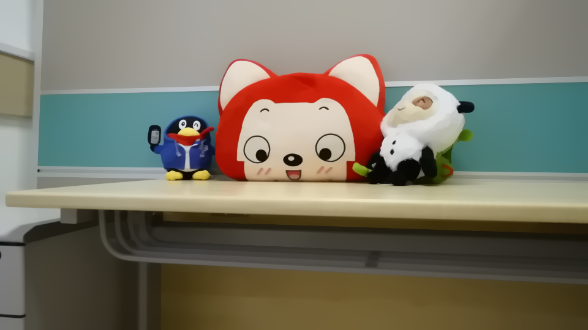

# Total Variation Image Denoising Simulation

This repository contains MATLAB code for performing image denoising using different methods and noise types. The main script initializes the denoising process and provides options for various configurations.

## Visualization Result
<p align="center">
    
    
    
</p>
<p align="center">
    <em>    Visualization of Results<br>
    Left: Original Image; 
    Middle: Noise Image; 
    Right: Denoised Image.</em>
</p>

## Prerequisites

- MATLAB installed on your system.
- Image Processing Toolbox for MATLAB.

## Usage

1. Prepare your images:
    - Place the images you want to denoise in the `images` folder.

2. Configure the settings in the `main.m` script:
    ```matlab
    img_folder = 'images';     % Folder containing images
    save_folder = 'exp01';     % Folder to save results
    method = 'gradient';       % Denoising method: 'chambolle' or 'gradient'
    noise_method = 'gauss';    % Noise method: 'gauss' or 'p&s'
    gaus_var = 0.01;           % Gaussian noise variance
    ps_prob = 0.05;            % Salt & Pepper noise probability
    strength = 0.1;            % Denoising strength
    strength_chroma = 0.2;     % Chromatic denoising strength
    ```

3. Run the `main.m` script:
    ```matlab
    main
    ```

## License

This project is licensed under the MIT License - see the [LICENSE](LICENSE) file for details.
